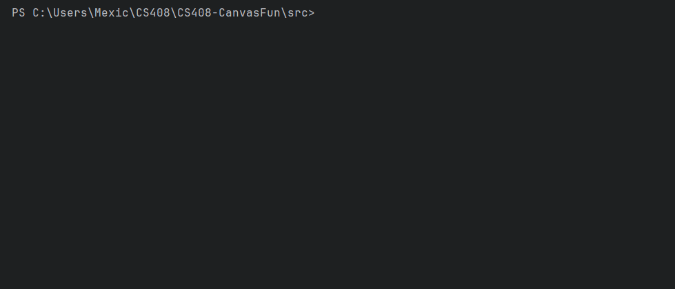

# CS408-CanvasFun
### Canvas CLI Tool

A simple Python command-line tool that allows students to interact with their Canvas account and retrieve class and assignment information.

## Features

Once running, the tool allows you to:

1. Display all current classes
2. Display information about a specific class
3. Display all grades for a specific class
4. Display upcoming assignments

## Installation

1. Clone this repository:

```bash
git clone https://github.com/<your-username>/<repo-name>.git
cd <repo-name>/src
